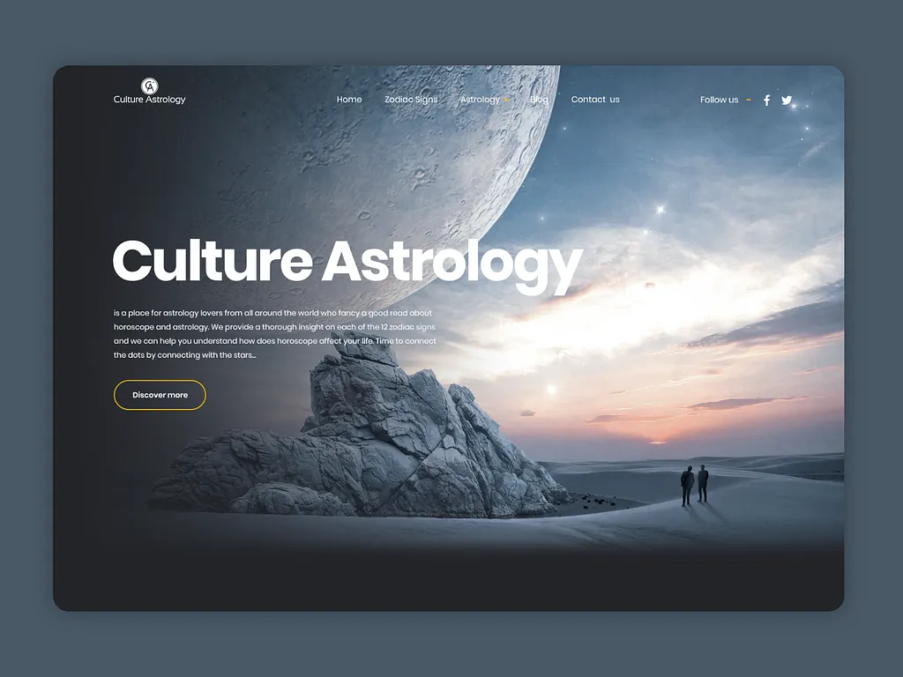

Build a modern premium astrology consultation website using React.js.

Create a fully responsive multi-section website for an astrology guru (Acharya Ji) with an elegant spiritual design.

Design theme:
Dark blue, gold, white, saffron accents, cosmic background, subtle zodiac patterns, smooth premium animations.

Website structure:

1. Sticky Header/Navbar

* Logo on left
* Navigation links: Home, About, Consultation, Shop, Testimonials, Contact
* Mobile responsive hamburger menu
* Smooth scrolling

2. Hero Section with Auto Sliding Banner
   Create a full-width carousel with automatic slide every 3 seconds.
    use same image

Banner 1:
Headline: Accurate Astrology Guidance
Subtext: Personalized horoscope solutions for life, career and relationships
Button: Book Consultation

Banner 2:
Headline: Trusted Vedic Astrology Solutions
Subtext: Expert consultation for marriage, business and health
Button: Talk to Acharya Ji

Banner 3:
Headline: Authentic Rudraksha & Gemstones
Subtext: Certified spiritual products
Button: Visit Shop

Add smooth transitions and navigation arrows.

3. About Acharya Ji Section
   Two-column layout.

Left:
Professional image placeholder

Right:

* Acharya Ji name
* Years of experience
* Specializations
* Biography
* Spiritual achievements

Buttons:
Book Appointment
Learn More

Add scroll animations.

4. Consultation Booking Section
   Prominent CTA section.

Button:
Book Consultation

On click open modal popup form with fields:

* Full Name
* Phone
* Email
* Date of Birth
* Time of Birth
* Place of Birth
* Consultation Type dropdown
* Preferred Date
* Message

Submit button should show success confirmation popup.

5. Services Section
   Responsive cards for:

* Kundli Analysis
* Match Making
* Career Guidance
* Business Astrology
* Gemstone Recommendation
* Vastu Consultation

Each card should have icon, short description and CTA button.

6. Shop Section
   Create ecommerce product showcase.

Categories:

* Rudraksha
* Gemstones
* Yantras

Each product card:

* Product image
* Product name
* Price
* Description
* Add to Cart button
* Buy Now button

Add category filters and sorting.

7. Testimonials Section
   Auto-sliding testimonials with:

* Customer image
* Name
* Review
* Star rating

8. Contact Section
   Include:

* Address
* Phone
* WhatsApp
* Email
* Google Maps placeholder
* Contact form

9. Footer
   Include:
   Quick links, social icons, privacy policy, copyright.

Technical requirements:

* React.js
* Tailwind CSS
* Smooth animations
* Modern clean component structure
* Fast loading
* SEO friendly
* Fully mobile responsive

Style inspiration:
Luxury spiritual astrology platform with premium professional look.

Avoid cluttered layout. Keep design elegant, minimal and trustworthy.
